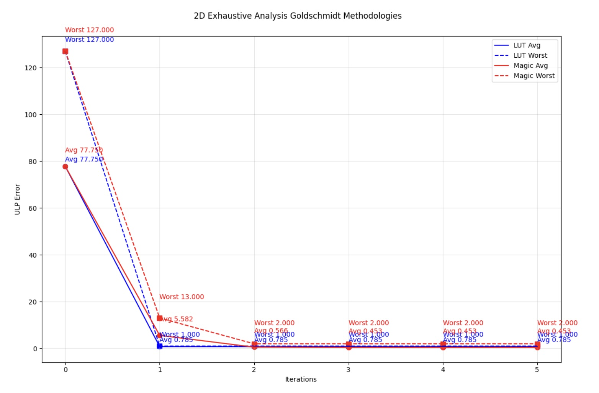

This implementation was largely based off this research paper

Roy, T. D. (2019). Implementation of Goldschmidt's algorithm with hardware reduction. arXiv preprint arXiv:1909.10154. [https://doi.org/10.48550/arXiv.1909.10154](https://doi.org/10.48550/arXiv.1909.10154)

# Divider Documentation

The Scalar-Core Divider is a fully pipelined floating-point division unit optimized for the BF16 (Brain Floating Point) format. Rather than using slow, traditional digit-recurrence algorithms (like SRT or restoring division) which require long and deep subtraction chains, the Vector-Core implements the **Goldschmidt Division Algorithm**.
To optimize for different PPA (Power, Performance, Area) targets within the accelerator, the Vector-Core features two distinct divider architectures that share the same underlying algorithm: an Area-Optimized 2-Multiplier design, and a Throughput-Optimized 3-Multiplier design.

### Shared Algorithm & The "Magic Number"
The Goldschmidt algorithm computes N / D by repeatedly multiplying both the numerator (N) and denominator (D) by a sequence of factors (F) such that the denominator converges toward 1.0. As D approaches 1.0, N approaches the final quotient.

To minimize the hardware iterations required, the algorithm needs a highly accurate initial guess of the reciprocal (1/D). Instead of wasting silicon area on a large Lookup Table (LUT) for this initial guess, both divider architectures utilize a **Constant Subtraction Trick (Magic Number)**. By exploiting the structure of the IEEE-754 / BF16 floating-point format, we can approximate the inverse by subtracting the denominator from a magic constant:

`new_f = 16'h7EF3 - new_muld;`

This specific magic number (`16'h7EF3`) was calculated using a python script on all 16,384 possible BF16 mantissas. After two iterations, this specific number proved to have the lowest average ULP while also maintaining a **MAX ULP of 2**. This number is specific to BF16 and cannot be parameterized. An FP16 equivalent would be (`16'h775F`) however this would require 3 iterations of the goldschmidt algorithm.

**The Iteration 2 Optimization:**
Because the algorithm only requires 2 iterations, the mathematical sequence looks like this:
* **Iteration 1:** N1 = N * F0 |
                   D1 = D * F0 |
                   F1 = 2.0 - D1

* **Iteration 2:** N2 = N1 * F1 |
                   D2 = D1 * F1

### 2 Multiplier Design
*Primary Author: Akhil Yada*

This architecture instantiates **2 Multipliers and 1 Subtractor** and utilizes a Loopback Pipeline Architecture (a "Carousel") to share the hardware across both iterations.

#### Hardware Architecture (The Carousel)
Data makes two passes through the same shared hardware blocks. The pipeline depth is meticulously tuned to match the internal latency of the locked arithmetic Hard IPs:
* The `common/arithmetic/multipliers/mul_bf16` Wallace tree multipliers compute in **1 clock cycle**.
* The `common/arithmetic/adders/add_bf16` subtractor computes in **2 clock cycles**.

To keep the control signals (exponents, signs, NaN flags) synchronized with the math, the wrapper shift registers are expanded to exactly **5 Stages**:
* **Stage 1 & 2:** Data enters and exits the multipliers.
* **Stage 3, 4, & 5:** Data (The denominator) enters, traverses the internal registers, and exits the subtractor. (The numerator rides a parallel 3-deep delay line `delay_n1_3:5` to stay synced).

#### Traffic Control
Traffic control was a challenge in this architecture. Because the pipeline holds 5 instructions in flight, data finishing its 5th stage must loop back to Stage 1, colliding with new input data. 

* **The Priority Arbiter:** A Stage 0 multiplexer gives absolute priority to Loopback traffic (`loopback_req`). If an instruction is looping back for Iteration 2, the Arbiter drops the `ready_in` signal, which stalls upstream to prevent data collision.

#### Backpressure
To handle backpressure, there is a global stall signal that stalls all the pipes and the math blocks

#### Performance
Because every division must pass through the shared 1-cycle multipliers and 2-cycle subtractor twice (consuming 50% of the datapath's bandwidth for loopbacks), the theoretical maximum throughput is 0.5 instructions per cycle. In testing, the divider successfully achieves an **Effective CPI of 2.0**. It also acheieves a max ULP of 2.0 and a average ULP of around 0.5.

### 3 Multiplier Design
*Primary Author: Brian Zhuang*

This architecture instantiates **3 Multipliers and 1 Subtractor** and is completely pipelined. 

#### Hardware Architecture
Data makes two total multiplication processes, first through one pair of multipliers, then the final multiplier for the second iteration:
* The `mul_bf16` Wallace tree multipliers compute in **1 clock cycle**.
* The `add_bf16` subtractor computes in **2 clock cycles**.

To match the timing requirement, the pipeline is split up to **9 Stages**:
* **Stage 1, 2:** Initial exponent difference calculated. Data enters the multipliers, numerator and denominators getting their own multiplier, and is multiplied by the magic number. Output is latched in stage 2 for next process.
* **Stage 3, 4, 5:** Data (The denominator) enters, traverses the internal registers, and exits the subtractor. Latches output value at stage 5.
* **Stage 6, 7:** The numerator from stage 2 is multiplied by the new "guess" from stage 5. Latches output value at stage 7.
registers, and exits the subtractor. Latches output value at stage 5.
* **Stage 8, 9:** Final exponent is calculated from initial exponent calculation in stage 1. Final answer then is latched in stage 9 where it is outputted.

#### Traffic Control
The pipe enable signals controls traffic and goes low when backpressure occurs (when the pipeline fills up).

#### Performance
The divider being fully pipelined achieves an **Effective CPI of 1.0** with max throughput. It also acheieves a max ULP of 2.0 and a average ULP of around 0.5, a value slightly lower than predicted.

### Comparison
Below is a table of results for both dividers. The ULP numbers are pulled from a test of all possible mantissas (16,384). Note that subnormals have been excluded as their ULP numbers will always be 0.

| Divider Version | # of 0 ULP | # of 1 ULP | # of 2 ULP | Avg ULP | Max ULP | Total Area (um^2) |
|---|---|---|---|---|---|---|
| 2-Multiplier Design | 8,687 | 7,052 | 645 | 0.51 | 2 | 18433.437 |
| 3-Multiplier Design | 8,687 | 7,052 | 645 | 0.51 | 2 | 22283.246 |

### Simulation
Below is a picture of the simulated ULP error at each iteration of the Goldschmidt division algorithm using both a magic number and LUT approach. This was simulated using the PyTorch library in Python.

