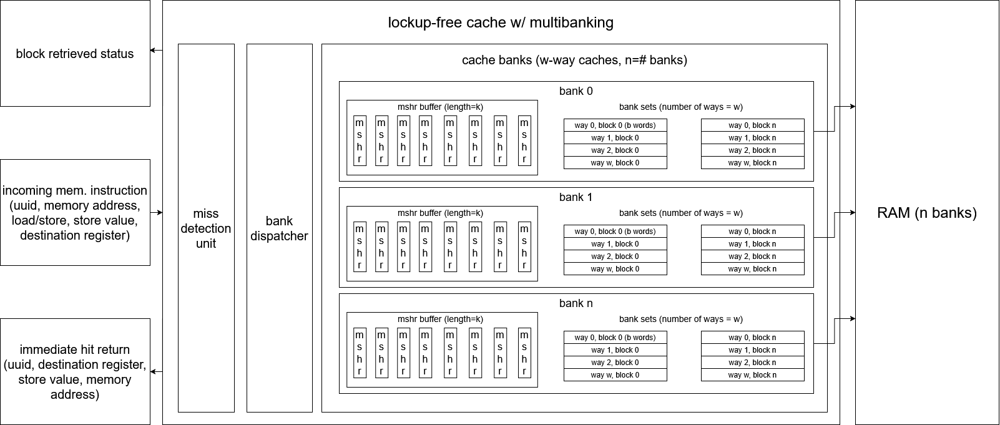
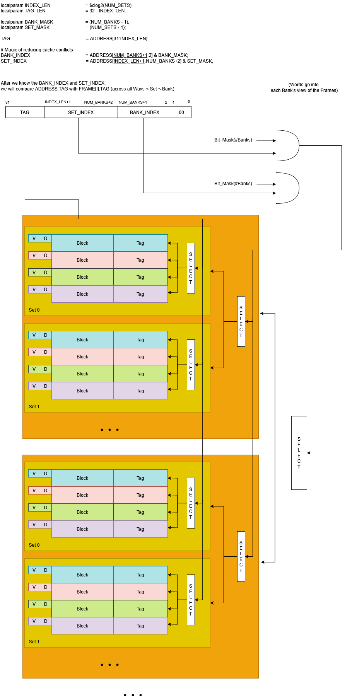
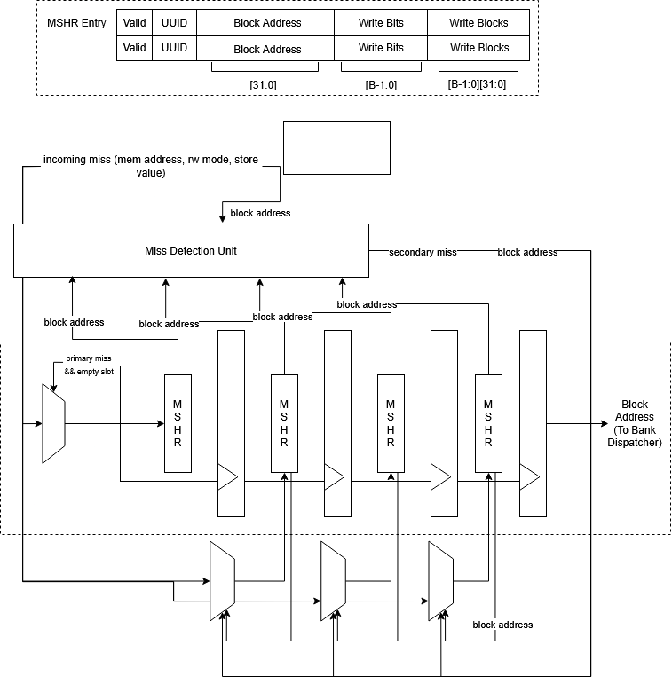

### Lockup-Free D/I Cache  

This project implements a lockup-free, multi-banked cache intended for integration with the SoCET AIHW and GPU cores. The design allows cache hits to complete independently of outstanding misses, while supporting multiple in-flight memory requests via per-bank MSHR queues.

The cache is fully parameterized (capacity, associativity, block size, banks, MSHR depth) and written in synthesizable SystemVerilog. The implementation targets realistic OoO scheduling behavior rather than simplified blocking semantics.

Code [here](https://github.com/Purdue-SoCET/atalla/tree/main/rtl/modules/memory/caches).
Report [here](https://github.com/Purdue-SoCET/atalla/blob/documentation_update_branch/docs/src/pdfs/lockupfreecache.pdf).

### Architectural Overview

At the top level, the cache is organized as N independent banks, each containing:

* a set-associative cache array
* a per-bank MSHR buffer
* replacement logic
* a bank-local control FSM

Incoming memory operations are classified in a multi-cycle FSM as:

* hit → serviced immediately by the target bank
* miss → enqueued into that bank’s MSHR buffer

Critically, hits and misses are serviced in parallel. In a single cycle, the design supports:

* up to N concurrent misses (one per bank)
* one hit resolution concurrently

Miss completion is decoupled from request issue via UUID tagging, allowing the processor to continue execution without stalling on outstanding memory operations.

---

### Banking and Set Interleaving

Banks partition the total set space rather than duplicating full cache structures. Set indices are interleaved across banks to maximize spatial parallelism:

* `bank_id = global_set_index % NUM_BANKS`
* `bank_set_index = global_set_index / NUM_BANKS`

This mapping allows sequential memory accesses (e.g., streaming through arrays) to naturally distribute across banks, enabling parallel block fills and reducing structural hazards. Banking also shortens tag-compare critical paths and aligns with multi-bank DRAM interfaces where available.

### Miss Status Holding Registers (MSHRs)

Each bank contains a FIFO-style MSHR buffer that tracks outstanding misses. An MSHR entry represents one cache block, not individual words.

Each MSHR stores:

* block address
* valid bit
* per-word write mask
* buffered store data (for store misses)
* UUID associated with the originating instruction

### Secondary Miss Coalescing

If a miss arrives for a block already present in the buffer, it is coalesced into the existing MSHR:

* store misses update the word mask and buffered data
* load misses reuse the same pending fill

This significantly reduces redundant memory traffic for spatially clustered accesses, a common pattern in OoO execution.

The buffer is implemented as a shift-based pipeline rather than pointer-indexed queue:

* new entries enter at the tail
* entries advance toward the head when unstalled
* the head MSHR is latched into the bank for processing

Latency added by shifting is negligible relative to DRAM service time.

### Bank Operation and Hit-Under-Miss

Each bank exposes two independent access paths:

1. Direct hit path for new memory instructions
2. MSHR head path for servicing outstanding misses

On a hit:

* tag comparison across all ways
* load returns data in the same cycle
* store updates data and dirty bit

On a miss:

* victim way selected
* victim invalidated before refill to prevent hit-after-evict hazards
* block fill applied
* buffered store data merged
* UUID returned upon completion

### MSHR Hit Resolution

A key corner case arises when a secondary miss reaches the bank after the primary miss has already been latched. To handle this, the bank performs MSHR hit detection:

* detects that the requested block is already resident (or in flight)
* suppresses unnecessary refetch
* allows pending writes to be applied correctly

This preserves correctness without forcing full reserialization of misses.

### Replacement Policy

Replacement uses an age-based LRU implementation:

* each way maintains an age counter
* on access, selected way resets to age 0
* all others increment
* max-age way is precomputed as victim

This approach generalizes cleanly to arbitrary associativity but introduces a long combinational path, which became the dominant timing bottleneck in synthesis.

Currently, tree-based (pseudo-LRU) is being added to reduce comparator depth and critical path length.

### Verification and Results

The design was fully unit-tested and system-tested. Verified behaviors include:

* hit-under-miss
* secondary miss coalescing
* MSHR corner cases
* replacement correctness
* basic load/store ordering

Synthesis (MIT-LL 90nm PDK) achieved:

* ~643 MHz post-synthesis frequency
* dominant critical path in LRU and MSHR comparison logic

The architecture is functionally complete but intentionally left open for pipeline refinement and timing-driven simplification.