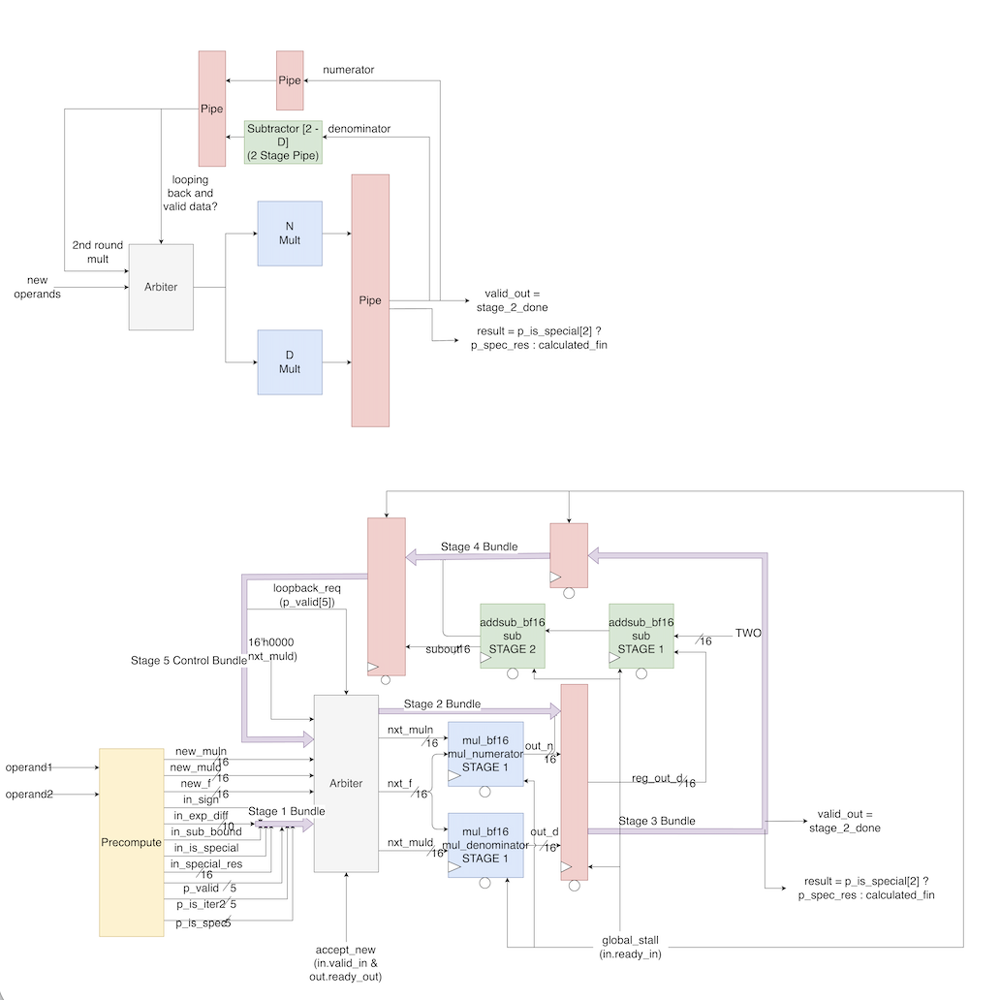
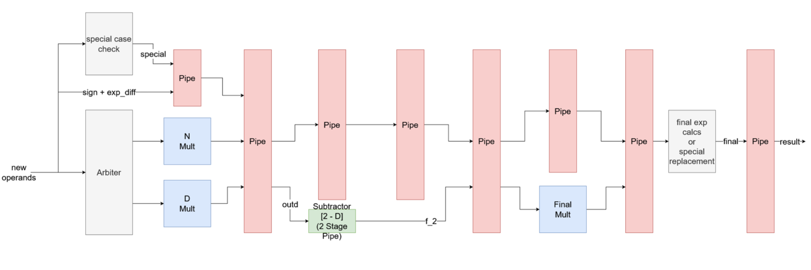
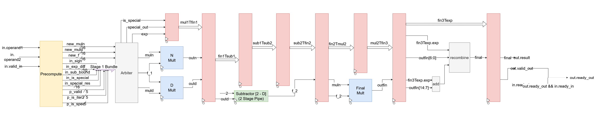

*Authors: Akhil Yada and Brian Zhuang*

This implementation was largely based off this research paper

Roy, T. D. (2019). Implementation of Goldschmidt's algorithm with hardware reduction. arXiv preprint arXiv:1909.10154. [https://doi.org/10.48550/arXiv.1909.10154](https://doi.org/10.48550/arXiv.1909.10154)

# Divider Documentation

The Divider is a fully pipelined floating-point division unit optimized for the BF16 (Brain Floating Point) format. Rather than using slow, traditional digit-recurrence algorithms (like SRT or restoring division) which require long and deep subtraction chains, this implements the **Goldschmidt Division Algorithm**.
To optimize for PPA (Power, Performance, Area) targets within the accelerator, we implement two distinct divider implementations that share the same underlying algorithm: an Area-Optimized 2-Multiplier design, and a Throughput-Optimized 3-Multiplier design.

## Goldschmidt Algorithm
The Goldschmidt algorithm computes N / D by repeatedly multiplying both the numerator (N) and denominator (D) by a sequence of factors (F) such that the denominator converges toward 1.0. As D approaches 1.0, N approaches the final quotient.

```
      F0 = initial guess;

Iteration 1: N1 = N * F0 
             D1 = D * F0 
             F1 = 2.0 - D1

Iteration 2: N2 = N1 * F1 
             D2 = D1 * F1
             F2 = 2.0 - F1

Iteration 3: ....
             ....
             ....

Iteration i-1: ...

Iteration i: N(i) = N(i-1) * F(i-1)

Final Answer: N(i)
```

While this can be done infinitely, accuracy does not increase infinitely. We found that in practice generally after 2-3 iterations a set of bf16 values the convergence caps and no longer changes the value.

The primary differences in approaching the goldschmidt algorithm is how to get this initial guess. There are two methods that are known to be effective, an LUT table and using "magic number".

### LUT

The LUT method has an array of preset values, in which the initial guess of the goldschmidt method is selected through the mantissa bits directly mapping into an index value in the LUT table. 

The LUT is the most commonly referred to method in selecting the initial guess for division, especially if area is not a large concern. Below is a python script that shows the methodology behind the generation. All that is being done is an accurate "in between" value between each step to best bring a denominator to the value of 1. 
```
entries = x
def generate_lut(size):
    step = 1.0 / size
    seeds = torch.zeros(size, dtype=torch.bfloat16)
    for i in range(size):
        a = 1.0 + (i * step)
        b = 1.0 + ((i + 1) * step)
        seeds[i] = 2.0 / (a + b)
    return seeds
```

### The "Magic Number"

To minimize the hardware iterations required, the algorithm needs a highly accurate initial guess of the reciprocal (1/D). Instead of wasting silicon area on a large Lookup Table (LUT) for this initial guess, both divider implementations utilize a **Constant Subtraction Trick (Magic Number)**. By exploiting the structure of the IEEE-754 / BF16 floating-point format, we can approximate the inverse by subtracting the denominator from a magic constant:

`new_f = 16'h7EF3 - new_muld;`

This specific magic number (`16'h7EF3`) was calculated using a python script on all 16,384 possible BF16 mantissas. After two iterations, this specific number proved to have the lowest average [ULP](https://www.emmtrix.com/wiki/ULP_Difference_of_Float_Numbers) while also maintaining a **MAX ULP of 2**. This number is specific to BF16 and cannot be parameterized. An FP16 equivalent would be (`16'h775F`) however this would require 3 iterations of the goldschmidt algorithm.

## Finalized Design Choices

Before deciding which design we'd stick to, we utilized a Python simulation to see if our math would work, as well giving ourselves the perspective to pick the design best suited for our needs. 

### Simulation
Below is a picture of the simulated ULP error at each iteration of the Goldschmidt division algorithm using both a magic number and LUT approach. This was simulated using the PyTorch library in Python. Example pseudo code and simulated graph is below. 
```
def goldschmidt_div(method, dividend, divisor, iterations):
    actual_q = float(n)/float(d)

    if d == 0: return torch.tensor(float('nan'))

    # Save Sign
    sign = MSB of bf16
    abs_n, abs_d = torch.tensor(abs(n), dtype=torch.bfloat16), torch.tensor(abs(d), dtype=torch.bfloat16)

    mantissa_n, exp_n = math.frexp(abs_n.item())
    mantissa_d, exp_d = math.frexp(abs_d.item())

    # Normalization
    n_w = mantissa_n * 2.0
    d_w = mantissa_d * 2.0
    if(LUT method)
      idx = mantissa bits
      f = lut[idx]
    if(Magic method)
      f = 0x7EF3 - abs_d

    for _ in range(iterations):
      n_w = n_w * f
      d_w = d_w * f
      f = 2.0 - d_w

    final_val = sign * n_w * (2.0**(exp_n - exp_d))
    res_bf = final_val.to(torch.bfloat16)
    ulp_err = calculate_ulp_error(final_val, actual_q)
    return res_bf, ulp_err
```


The LUT simulated is only a 16 elements large, which is the smallest LUT possible while maintaining a maximum of 1 ULP. Obviously a larger LUT (most appropriately a 128 elemnt one for each mantissa bit) will greatly improve average ULP, but it comes at the great cost of significaltly more area per divider. 

As it can be seen the LUT methodology outperforms the magic number in worst ULP, but but loses in consistancy. It is important to note that we are creating an alternative to the IEEE slow method, in which it takes 11 cycles with perfect accuracy, but is neither pipelined, nor able to take multiple inputs in flight. Our goal is speed and efficiency. The LUT with more area is on average worse than the magic number, and would require an even larger area cost to simply exceed the magic number in both average ULP and worst ULP. These area costs are simply not worth the marginal accuracy benefits that can be provided with a singular value. 


**Final Design Choices:**
In our python simulation we also see that among both methodologies it is determined that only 2 iterations are needed to ensure a maximum ULP of 1-2 and any more iterations do not effect the ULP. Because the algorithm only requires 2 iterations, the mathematical sequence looks like this:

```
      F0 = 16'h7EF3 - D;

Iteration 1: N1 = N * F0 
             D1 = D * F0 
             F1 = 2.0 - D1

Iteration 2: N2 = N1 * F1

      Result = N2
```

## 2 Multiplier Design
*Primary Author: Akhil Yada*

This architecture instantiates **2 Multipliers and 1 Subtractor** and utilizes a Loopback Pipeline Architecture (a "Carousel") to share the hardware across both iterations.

#### Hardware Architecture (The Carousel)
Data makes two passes through the same shared hardware blocks. The pipeline depth is tuned to match the internal latency of the pipelined arithmetic blocks:
* The `common/arithmetic/multipliers/mul_bf16` Wallace tree multipliers compute in **1 clock cycle**.
* The `common/arithmetic/adders/add_bf16` subtractor computes in **2 clock cycles**.

To keep the control signals (exponents, signs, NaN flags) synchronized with the math, the wrapper shift registers are expanded to exactly **5 Stages**:
* **Stage 1 & 2:** Data enters and exits the multipliers.
* **Stage 3, 4, & 5:** Data (The denominator) enters, traverses the internal registers, and exits the subtractor. (The numerator rides a parallel 3-deep delay line `delay_n1_3:5` to stay synced).

#### Traffic Control
Traffic control was a challenge in this architecture because it is not fully pipelinable and can have structural hazards. Because the pipeline holds 5 instructions in flight, data finishing its 5th stage must loop back to Stage 1, colliding with new input data. 

* **The Priority Arbiter:** A Stage 0 multiplexer gives absolute priority to Loopback traffic (`loopback_req`). If an instruction is looping back for Iteration 2, the Arbiter drops the `ready_in` signal, which stalls upstream to prevent data collision.

#### Backpressure
Backpressure occurs when downstream consumer is not ready for the divider's output. To handle this, there is a global stall signal that stalls all the pipes and the math blocks when ready_out is low, effectively applying backpressure through to the upstream producer.

#### Performance
Because every division must pass through the shared 1-cycle multipliers and 2-cycle subtractor twice (consuming 50% of the datapath's bandwidth for loopbacks), the theoretical maximum throughput is 0.5 instructions per cycle. In testing, the divider successfully achieves an **Effective CPI of 2.0**. It also acheieves a max ULP of 2.0 and a average ULP of around 0.5.

Below is a block diagram and RTL diagram of the design



## Pipelined Design
*Primary Author: Brian Zhuang*

This architecture instantiates **3 Multipliers and 1 Subtractor** and is completely pipelined. 

#### Hardware Architecture
Data makes two total multiplication processes, first through one pair of multipliers, then the final multiplier for the second iteration:
* The `mul_bf16` Wallace tree multipliers compute in **1 clock cycle**.
* The `add_bf16` subtractor computes in **2 clock cycles**.

To match the timing requirement, the pipeline is split up to **9 Stages**:
* **Stage 1, 2:** Initial exponent difference calculated. Data enters the multipliers, numerator and denominators getting their own multiplier, and is multiplied by the magic number. Output is latched in stage 2 for next process.
* **Stage 3, 4, 5:** Data (The denominator) enters, traverses the internal registers, and exits the subtractor. Latches output value at stage 5.
* **Stage 6, 7:** The numerator from stage 2 is multiplied by the new "guess" from stage 5. Latches output value at stage 7.
registers, and exits the subtractor. Latches output value at stage 5.
* **Stage 8, 9:** Final exponent is calculated from initial exponent calculation in stage 1. Final answer then is latched in stage 9 where it is outputted.

#### Traffic Control
The pipe enable signals controls traffic and goes low when backpressure occurs (when the pipeline fills up).

#### Performance
The divider being fully pipelined achieves an **Effective CPI of 1.0** with max throughput. It also acheieves a max ULP of 2.0 and a average ULP of around 0.5, a value slightly lower than predicted.

Below is a block diagram and RTL diagram of the design



## Comparison
Below is a table of results for both dividers. The ULP numbers are pulled from a test of all possible mantissas (16,384). Note that subnormals have been excluded as their ULP numbers will always be 0. The target frequency to obtain the synthesis number was 555 MHz, and the process node was MITLL90nm.

| Divider Version | # of 0 ULP | # of 1 ULP | # of 2 ULP | Avg ULP | Max ULP | Total Area (um^2) |
|---|---|---|---|---|---|---|
| 2-Multiplier Design | 8,687 | 7,052 | 645 | 0.51 | 2 | 18433.437 |
| 3-Multiplier Design | 8,687 | 7,052 | 645 | 0.51 | 2 | 22283.246 |
