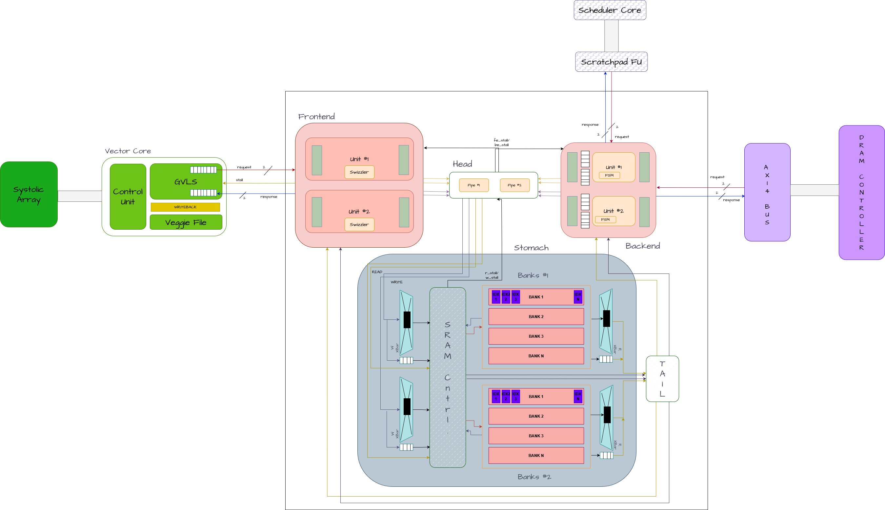

Code [here](https://github.com/Purdue-SoCET/atalla/tree/main/rtl/modules/memory/scratchpad). 

Modern AI Accelerators, like the Atalla [Ax01 core](https://github.com/Purdue-SoCET/atalla/tree/main), depend on exploiting predictable, high-bandwidth data movement between on-chip memory and compute modules. The Machine Learning (ML) workloads that these specialized chips target inherently expose deterministic access patterns – including tiled matrix multiplication, toeplitz-based convolution, tensor transposes and vector operations. The memory primitive in such architectures are arrays, often called vectors, as opposed to the scalar-optimized general-purpose chips. Additionally, these chips implement memory hierarchies that rely on conventional cache designs, accommodating a wide variety of workloads. These mechanisms are defined by tag overheads, unpredictable latencies, and hardware-based prefetchers that are optimized for adapting to different workload characteristics at runtime. 

In order to study alternate designs that exploit the aforementioned data regularity, Atalla Ax01’s “Scratchpad” architecture implements a parameterizable software-controlled memory subsystem that combines (1) a tile-descriptor-based DMA engine (2) SRAM-banking strategies evaluated on different technology nodes, and (3) four multi-stage interconnect topologies that re-arrange vectors on-the-fly. The architecture provides for swizzle-based movement, avoiding bank-conflicts for wide vector-reads and transpose-friendly micro-op scheduling. 

A core component of the explored design space were the interconnect micro-architectures - Benes, Batcher-Banyan, CLOS - simply referred to as crossbars. All designs were synthesized on the MIT-LL 90nm CMOS process node, and optimized for area, power and clock frequency. A Python-based emulator was built to confirm the viability of the design for the targeted behaviour, and simulated against every possible data-access pattern. The micro-architecture was implemented and modelled at a gate-level using SystemVerilog - within the industry-standard QuestaSim - achieving code coverage of 90%+. 

The work accomplished by this team has laid the foundation for a hardware-software co-designed kernel library that will provide optimized implementations of core vector and matrix operations. In parallel, a custom compiler is being developed to lower this code into instruction bundles, enabling parallel execution of µ-ops to use the asynchronous data-movement features of the Scratchpad. The Atalla Ax01 accelerator will feature a 4-wide tainted-VLIW scheduler, split-transaction AXI-bus and dual-channel DDR4 controller to complement the Scratchpad design. 

<embed src="pdfs/ScratchpadReport.pdf" type="application/pdf" width="100%" height="900px" />
