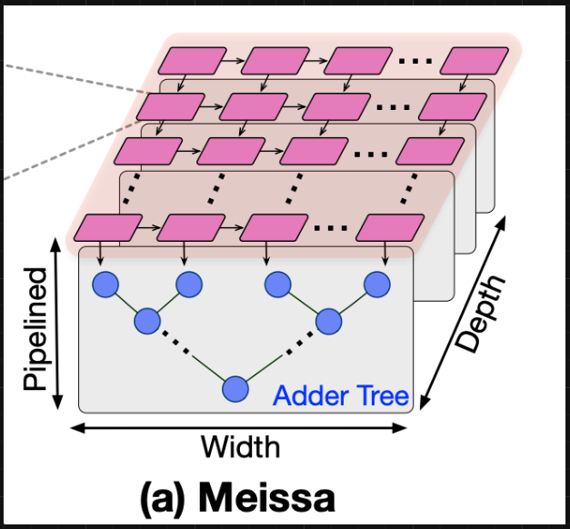
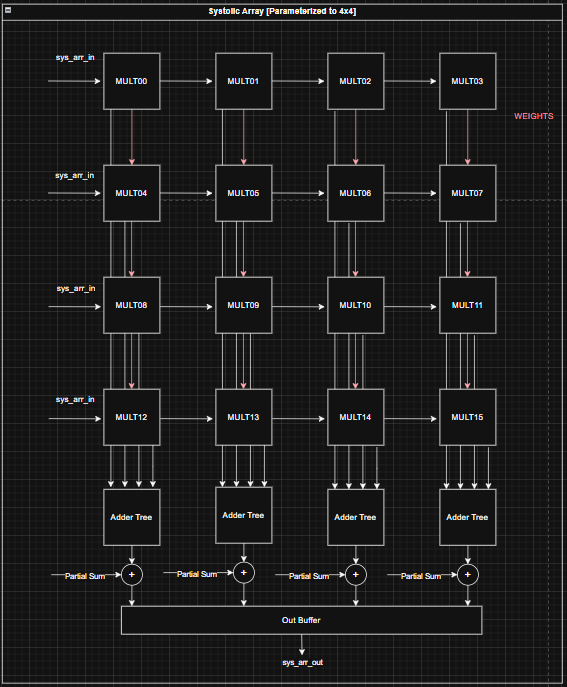
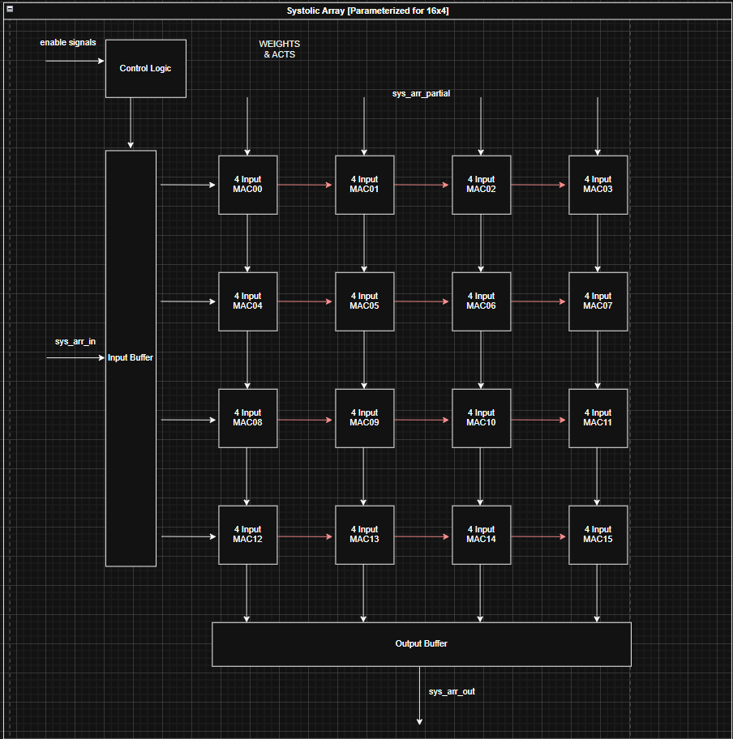
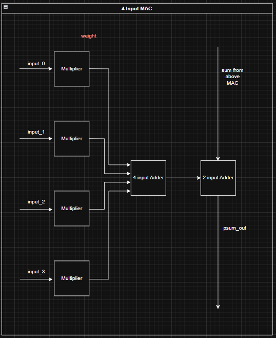
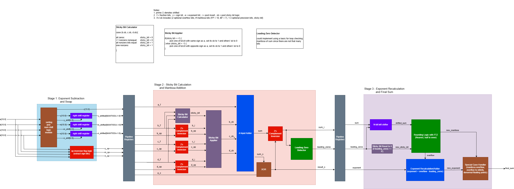

# Systolic Array

## Systolic Array Architectures

### Weight-Stationary Systolic Array

**Description**: 

**Block Diagram**: [Top Level](../img/systolic_array_diagram.png)

**Code**:

**Important Architecture Decisions**:

**Verification**:
- The testbeneches are found [here](https://github.com/Purdue-SoCET/atalla/tree/systolic_array_arch/tb/unit/systolic_array)
- The test generation scripts are found [here](https://github.com/Purdue-SoCET/atalla/tree/systolic_array_arch/scripts/systolic_array)

### MEISSA

**Description**: The MEISSA (Multiplying Matrices Efficiently in a Scalable Systolic Architecture) design performs GEMM (General Matrix Multiplication). The design is parameterized to support FP16 and BF16 data types.

**Block Diagram**: 
                   

**Code**: [here](https://github.com/Purdue-SoCET/atalla/tree/systolic_array_arch/rtl/modules/systolic_array)

**Important Architecture Decisions**: The architecture was based on this [Georgia Tech paper](https://hparch.gatech.edu/papers/bahar_2020_meissa.pdf). The MEISSA design decouples the MAC units into a multiplier grid and an adder tree for each column. This allows inputs to enter the multiplier grid without staggering, removing the need for an input buffer. MEISSA uses a weight stationary approach, where weights are input as columns then held in the multipliers. Activations are then sent in row-wise and stream through the multiplier grid and adders. MEISSA produces outputs along the diagonals of the result matrix. A wraparound output buffer is used to organize these outputs into rows.

**Verification**:
- The testbeneches are found [here](https://github.com/Purdue-SoCET/atalla/tree/systolic_array_arch/tb/unit/systolic_array)
- The test generation scripts are found [here](https://github.com/Purdue-SoCET/atalla/tree/systolic_array_arch/scripts/systolic_array)

**Reference Used**: [Georgia Tech Paper](https://hparch.gatech.edu/papers/bahar_2020_meissa.pdf)

### TPU Style

**Description**: The TPU (Tensor Processing Unit) design preforms GEMM. The implementation is parameterized to support FP16 and BF16 data types.

**Block Diagram**: 
                   

**Code**: [here](https://github.com/Purdue-SoCET/atalla/tree/systolic_array_arch/rtl/modules/systolic_array)

**Important Architecture Decisions**: This architecture is based on this [Google TPU Patent](https://patentimages.storage.googleapis.com/a6/f3/04/8aa9677623fd16/US20200327186A1.pdf). The design uses a weight stationary approach where weights are loaded in columns-wise and held in the multiplier. The activation matrix is stored into an input buffer, and inputs to the multipliers are staggered in groups of 4. The outputs of the TPU are staggered so an output buffer is used to organize the result into rows.

**Verification**:
- The testbenches are found [here](https://github.com/Purdue-SoCET/atalla/tree/systolic_array_arch/tb/unit/systolic_array)
- The test generation scripts are found [here](https://github.com/Purdue-SoCET/atalla/tree/systolic_array_arch/scripts/systolic_array)

**Reference Used**: [Google TPU Patent](https://patentimages.storage.googleapis.com/a6/f3/04/8aa9677623fd16/US20200327186A1.pdf)

## Arithmetic Modules

### 4-Input Floating Point Adder

**Description**: The 4-input floating point adder performs fused addition of 4 floating point values. The HDL is parameterized to support various standard and non-standard floating point formats, including FP16, FP32, and BF16. 

**Block Diagram**: 

**Code**: https://github.com/Purdue-SoCET/atalla/blob/4_input_fp_adder/rtl/modules/systolic_array/sysarr_4_input_fp_adder.sv

The adder contains three pipelined stages
1. Exponent Alignment and Mantissa Expansion
2. Stage 1 Addition
3. Stage 2 Addition, LZD, Exponent Recalculation, Mantissa Normalization, and Final Output

**Important Architecture Decisions**: The architecture was based on this IEEE paper (https://ieeexplore.ieee.org/document/11008646). The adder implements DAZ and FTZ logic for simplicity and speed. 

The exponent alignment stage determines the largest of the four input exponents and calculates the difference between it and the other three exponents. The mantissa is expanded with 22 precision bits and shifted according to the exponent differences. 

The second stage inverts the mantissas according to the sign bits of the original operands and performs a fused addition. The first stage of the addition uses a carry-save adder for speed. 

The third stage uses a ripple carry adder to finish the addition operation, and uses a tree-based LZD to detect leading zeroes. The mantissa is rounded to the original format using rounding to nearest, half to even logic. The exponent is recalculated based on LZD and rounding overflow, and the final output is compiled, taking into account special cases detected in the exponent alignment stage. 

**Verification**: 
 - The adder was verified through testing against the Berkeley Softfloat Library (https://github.com/ucb-bar/berkeley-softfloat-3). 
 - The testbenches can be found here: https://github.com/Purdue-SoCET/atalla/blob/4_input_fp_adder/tb/unit/systolic_array/. 
 - The test cases generation scripts can be found here: https://github.com/Purdue-SoCET/atalla/blob/4_input_fp_adder/scripts/systolic_array/. 

 **Reference Used**: https://ieeexplore.ieee.org/document/11008646
