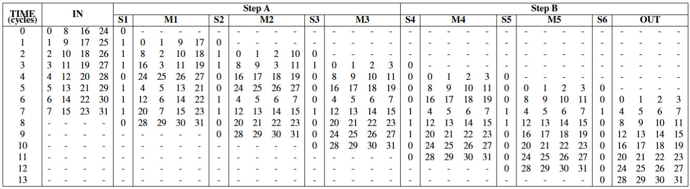
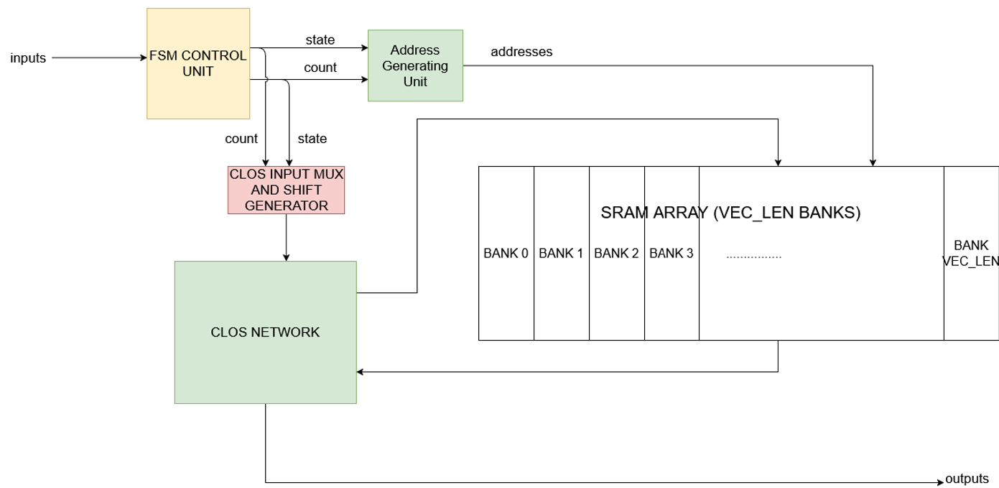
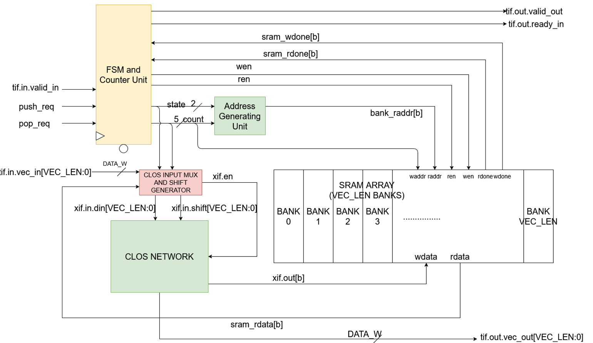
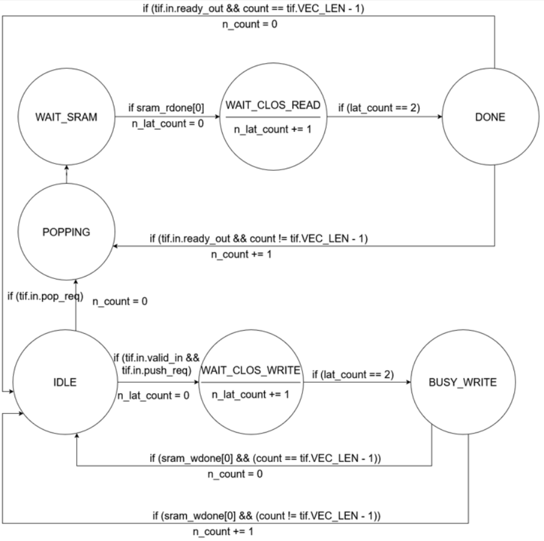

*Authors: Akhil Yada and Brian Zhuang*

This impelmentation is based off the SRAM variation of transposition in the paper below

Matrix Transposition in Hardware: Challenges and Approaches YANJI LU [https://www.diva-portal.org/smash/get/diva2:2005914/FULLTEXT01.pdf](https://www.diva-portal.org/smash/get/diva2:2005914/FULLTEXT01.pdf)

# Transpose Documentation

Matrix tranposition has various ways that it can be done, however the primary limitation filtering out a large majority of these methods is the fact that data is transferred vector by vector, as such methodologies that rely on knowing the entire vector is not considered due to massive cycle cost. There is also the need for the tranposition method to work with Mx32 matricies (non-square matricies). 

As such we are left with only two options

## Register-based Approach
```
input: block size 𝑁, number of blocks 𝐾, matrix 𝐴𝑖𝑗
output: transposed matrix 𝐴
1: Step A: Exchange of elements within a block
2: for 𝑠𝑡𝑎𝑔𝑒 = 0 to 𝑁 − 2 do
3: for 𝑘 = 1 to 𝐾 doa
4: for 𝑟𝑜𝑤 = (𝑘 − 1) × 𝑁 to 𝑘 × 𝑁 − 2 − 𝑠𝑡𝑎𝑔𝑒 do
5: for 𝑐𝑜𝑙 = 𝑠𝑡𝑎𝑔𝑒 + 1 to 𝑁 − 1 do
6: Swap(𝐴[𝑟𝑜𝑤, 𝑐𝑜𝑙], 𝐴[𝑟𝑜𝑤 + 1, 𝑐𝑜𝑙 − 1])
7: end for
8: end for
9: end for
10: end for
11: Step B: Exchange of elements between blocks
12: for 𝑠𝑡𝑎𝑔𝑒 = 0 to (𝐾 − 1) × (𝑁 − 1) − 1 do
13: for 𝑟𝑜𝑤 = 𝑅𝑂𝑊 to 𝑅𝑂𝑊 + Δ𝑟𝑜𝑤 − 1 do
14: for 𝑐𝑜𝑙 = 0 to 𝑁 − 1 do
15: Swap(𝐴[𝑟𝑜𝑤, 𝑐𝑜𝑙], 𝐴[𝑟𝑜𝑤 + 1, 𝑐𝑜𝑙])
16: end for
17: end for
18: end for
19: return 𝐴 =0
𝑅𝑂𝑊 = [𝐾 − 1 − mod(𝑠𝑡𝑎𝑔𝑒, 𝐾 − 1)] × [𝑁 − div(𝑠𝑡𝑎𝑔𝑒, 𝐾 − 1)]
Δ𝑟𝑜𝑤 = [mod(𝑠𝑡𝑎𝑔𝑒, 𝐾 − 1) + 1] × [𝑁 − 1 − div(𝑠𝑡𝑎𝑔𝑒, 𝐾 − 1)]
```
This algorithm is a two-phase block-based transposition. Unlike a standard transposition that swaps A[i,j] with A[j,i] directly, this approach uses a structured "shuffling" mechanism. It is designed to move elements into their transposed positions through a series of local and global swaps.

Here is the high-level breakdown of how it operates:
### Phase 1: Intra-Block Permutation (Step A)

The first phase focuses on the local geometry of the data. Instead of looking at the whole matrix, it treats the matrix as a series of K vertical blocks, each of size N×N.

The Goal: To rearrange the elements within each individual block so they are ready for the global move.

The Mechanism: It uses a "diagonal swap" pattern. By iterating through stages and swapping adjacent elements (specifically A[row,col] with A[row+1,col−1]), it essentially performs a local skewing or rotation of the data within those block boundaries.

Result: By the end of Step A, the elements are no longer in their original row/column order, but are positioned such that a vertical shift will place them in their final transposed coordinates.

### Phase 2: Inter-Block Exchange (Step B)

The second phase handles the global movement across the different blocks.

The Goal: To move the locally-permuted elements to their final destination blocks.

The Mechanism: This step uses calculated indices (ROW and Δrow) to perform bulk swaps of entire rows between different sections of the matrix.

The mod and div logic in the indices suggests a cyclic shift or a "butterfly-style" exchange pattern.

It moves data across the boundaries of the K blocks, effectively turning the "tall" structure of the input into the "wide" structure of a transposed layout (or vice versa).



## SRAM Based Approach
It is a 32x32 CLOS network that barrel shifts the vectors into 32 SRAM banks as they are inputted, then is read using another 32x32 CLOS network to properly pull the correct transposed matrix. 

Below is an visualized example using a 4x4 matrix. 

```
Iteration 0:
 B0  B1  B2  B3
  x | x | x | x
  x | x | x | x
  x | x | x | x
  x | x | x | x

Iteration 1:
  1 | x | x | x
  x | 1 | x | x
  x | x | 1 | x
  x | x | x | 1

Iteration 2:
  1 | 2 | x | x
  x | 1 | 2 | x
  x | x | 1 | 2
  2 | x | x | 1

Iteration 3:
  1 | 2 | 3 | x
  x | 1 | 2 | 3
  3 | x | 1 | 2
  2 | 3 | x | 1

Iteration 4:
  1 | 2 | 3 | 4
  4 | 1 | 2 | 3
  3 | 4 | 1 | 2
  2 | 3 | 4 | 1
```

Each column of the matrix is a SRAM bank. The entire process is parallelized, for maximum throughput. When the transpoesed vector needs to be read it simply goes row by row, and does the appropriate shifts depending on which number transposed vector you are reading. All the positioning can be tracked through counters. 

Between the two designs the SRAM approach was selected due to its simplicity, and the fact that both SRAM banks and CLOS network code had already existed, so implementing the idea would be much easier.

## Design Decesions

Below is the very basic outline of a block diagram, and more specific RTL diagram. You can see that due to the already prexisitng modules the design is quite simple. 



The primary addition not in consideration in the initial methodology selection is the way in which scratchpad communicates with the transpose unit. In our case we expect N number of 32 bit vectors being pushed into the SRAM, and once a single pop command is sent, it will pop the entire 32 transposed matrix. 

Below is the state machine diagram



## Performance
The amount of cycles required to push a matrix into the transpose unit is Nx3 cycles for how many vectors initially sent to be transpsed. Two cycles for the CLOS network to complete, one more cycle to write into SRAM. For popping another 32x3 cycles for popping, same idea as for pushing.. 


### Timing Summary
| Analysis View | Clock | Period (ps) | Critical Slack | TNS | Violating Paths |
| :--- | :--- | :--- | :--- | :--- | :--- |
| view_1p2_25 | clock1 | 1667.0 | 745.9 | 0.0 | 0 |


### Area Specifications
| Category | Area ($\mu m^2$) |
| :--- | :--- |
| **Cell Area** | 18,704.322 |
| **Net Area** | 15,170.390 |
| **Total Area (Cell+Net)** | **33,874.712** |

### Power Consumption
| Component | Power (nW) |
| :--- | :--- |
| **Leakage Power** | 364,477.186 |
| **Dynamic Power** | 23,115,499.852 |
| **Total Power** | **23,479,977.038** |

