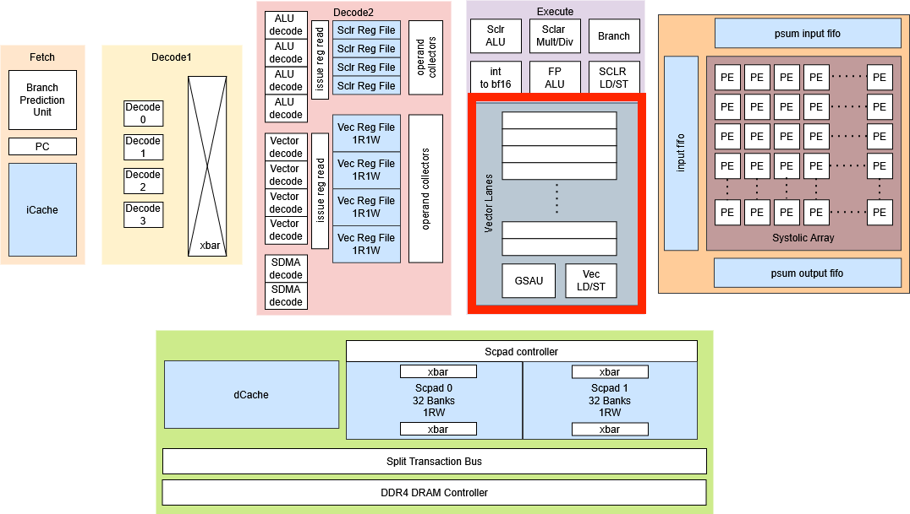
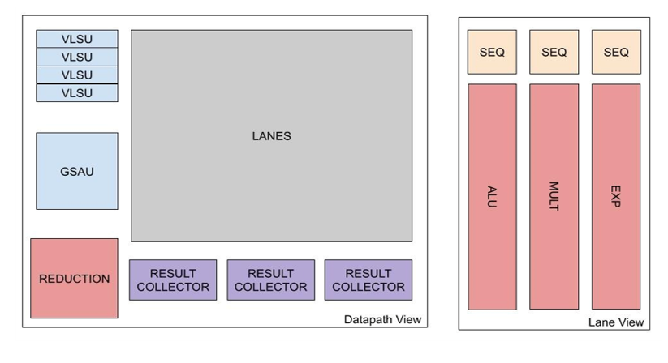

# Vector Core

> Vector Core design for accelerating nonlinear layers and vector operations in the Atalla AI Chip.

---

| Field               | Details                                                                                                                                     |
| ------------------- | ------------------------------------------------------------------------------------------------------------------------------------------- |
| **Project Status**  | Completed                                                                                                                                   |
| **Timeline**        | Spring 2026                                                                                                                                 |
| **Team Members**    | Julio Hernandez, Jacob Walter, Vedant Sharma, Mayank Patibandla, Akhil Yada, Brian Zhuang                                                   |
| **Primary Contact** | Vedant Sharma                                                                                                                               |
| **Lead**  | Fan Jing Hoon                                                                                                                                         |
| **Branch**          | `Vector_S26_L1_TB`                                                                                                                          |
| **Path**          | `rtl/modules/vector`                                                                                                                          |
| **Revision ID**     | `0.0.1`                                                                                                                                     |
| **Final Report**    | [Vector Core Final Report](https://github.com/Purdue-SoCET/atalla/blob/documentation_update_branch/docs/src/pdfs/s26_vectorcore_report.pdf) |
| **Last Updated**    | 2026-07-02                                                                                                                                  |

---

## Overview

The **Vector Core** accelerates element-wise nonlinear operations in the Atalla AI Chip. These operations appear frequently in AI workloads, especially in activation functions, normalization layers, reductions, Softmax, GELU, and transpose-heavy attention paths. This project improves the prior Vector Core by replacing slow and area-heavy per-lane arithmetic units with more efficient shared or redesigned units, adding a dedicated transpose unit, completing the Vector Load Store Unit, and improving integration with the Scratchpad, Systolic Array, and Scheduler. The final design uses a **16-lane SIMD datapath**, supports **32-element vector operations**, and was synthesized on **FreePDK 45-nm at 800 MHz**.

---

## System Diagram

The Vector Core handles element-wise vector operations that are not efficient to run on the Systolic Array. The Systolic Array handles GEMM-heavy computation, while the Vector Core handles activation functions, reductions, normalization support, data movement, and transpose-related operations.

```python
Scheduler
   ↓
Vector Register File
   ↓
Vector Core Datapath
   ↓
Lanes / Reduction / VLSU / GSAU / Transpose
   ↓
Writeback Buffer
   ↓
Vector Register File
```




---

## Onboarding Guide

This section lists the background needed before modifying the Vector Core.

### Required Background

Read these first:

* **SIMD / Vector Processing**

  * Understand how one instruction operates across many data elements.
  * Understand why the Vector Core uses **16 lanes** for a **32-element vector**.
  * Understand how each lane processes a slice of the full vector.

* **BF16 Arithmetic**

  * Understand BF16 format: sign, exponent, and mantissa.
  * Understand why BF16 is used for AI workloads.
  * Understand **ULP** as an accuracy metric.

* **AI Workloads**

  * ReLU
  * GELU
  * Softmax
  * LayerNorm
  * Transpose for attention workloads
  * Pooling for CNN-style workloads

* **Valid/Ready Handshake**

  * Understand `valid`, `ready`, and transfer timing.
  * Understand backpressure.
  * Understand why different-latency units need handshake-based interfaces.


### Recommended Reading Order

1. Read this page fully.
2. Read the final report.
3. Study the top-level Vector Core diagram.
4. Read the Vector Core top-level RTL.
5. Read the lane datapath.
6. Read the reciprocal, exponential, transpose, and VLSU modules.
7. Run the existing testbench flow.
8. Inspect waveforms for one full vector operation.
9. **Only then** modify the datapath or scheduler-facing interfaces.

---

## Architecture


### Main Modules


### Data Flow

Normal vector operation flow:

1. The **Scheduler** issues a vector instruction.
2. Source operands are read from the **Vector Register File**.
3. Data is distributed across **16 vector lanes**.
4. Each lane processes a 2-element slice of the 32-element vector.
5. Results are gathered by global result collectors.
6. The **Writeback Buffer** writes results back into the VRF.

For memory operations:

1. The Scheduler issues a vector load or store.
2. A **VLSU** sends or receives data through one Scratchpad channel.
3. Load destinations are tracked in a load queue.
4. Returned data is written back into the VRF.
5. Backpressure is handled with valid/ready handshaking.

For transpose operations:

1. Input vectors are pushed into the Transpose Unit.
2. A CLOS network routes data into SRAM banks.
3. The matrix is stored in transposed layout.
4. Output vectors are popped sequentially.
5. The transposed vectors are returned to the Vector Core path.

---

## Future Work

Major future directions:

* Run end-to-end performance benchmarking on full activation kernels.
* Measure cycle counts for workloads such as **Softmax**, **GELU**, and **LayerNorm**.
* Use the performance monitor to collect per-unit utilization and stall data.
* Study whether the single scalar reciprocal unit becomes a bottleneck.
* Consider adding a skid buffer or second reciprocal unit.
* Study whether the exponential unit should be pipelined for higher clock frequency.
* Improve Transpose Unit utilization for matrices smaller than `32 x 32`.
* Reduce pipeline bubbles between consecutive transpose operations.
* Resize the VLSU load queue if Scratchpad latency changes.
* Study whether 4 VLSUs are actually needed for target workloads.
* Explore an **MxN sub-lane Vector Core** architecture.
* Add better hardware support for **pooling** operations.

---

## Revision History

| Date       | Revision ID | Author        | Notes                                                          |
| ---------- | ----------- | ------------- | -------------------------------------------------------------- |
| 2026-07-02 | `0.0.1`     | Akshath Ravikiran | Initial documentation page from Spring 2026 Vector Core report |

---

