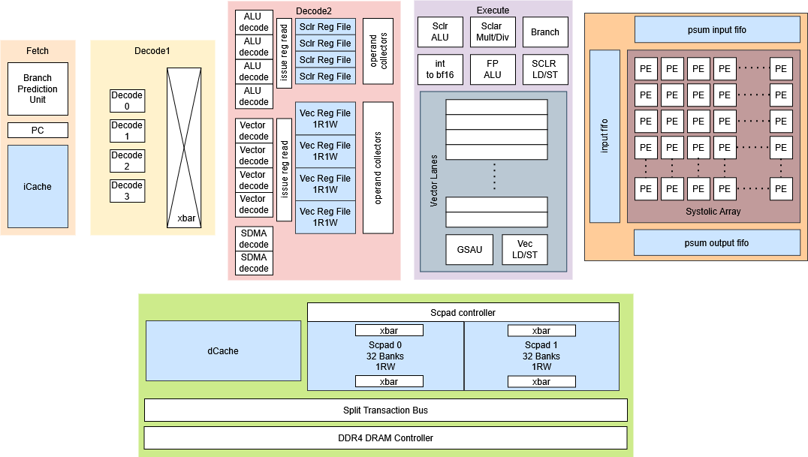

> [!IMPORTANT]
> This documentation is under active construction. It’s intended to be the source of truth for all contributors and future maintainers. 
> Reach out to socet@purdue.edu with questions!

Atalla is a student-led effort within [SoCET](https://engineering.purdue.edu/SoC-Team) at [Purdue University](https://engineering.purdue.edu/ECE) to design a research-grade AI accelerator stack end-to-end.

Modern deep-learning workloads demand high TOPS/W and predictable dataflow. Atalla explores a programmable accelerator architecture that is contributed to by the following teams: 

* Compute: Systolic Array — parameterizable array with three implementations: *naïve baseline*, *MEISSA-inspired*, and *TPU-inspired* dataflows.
* On-Chip Memory: Scratchpad + Lockup-Free Caches — software-managed scratchpad hierarchy and non-blocking cache subsystem to keep compute saturated with predictable access. 
* Memory System: DDR4 + Split-Transaction AXI4 — a non-blocking DDR4 controller and split-transaction interconnect; integrating Ramulator2-style timing models for flexible, cycle-accurate memory behavior.
* Systems Software: Kernels + PyTorch Flow — kernel implementations targeting the custom ISA, plus integration into a PyTorch-front-end workflow; includes emulator + cycle-accurate simulation.
* Compiler Toolchain (PPCI-based) — compiler infrastructure to lower high-level ops into the ISA and schedule memory movement.
* Hardware Scheduler: VLIW Control — VLIW-style scheduling hardware for deterministic, explicitly scheduled execution.
* Emulation: HAPS FPGA Bring-Up — deploy and validate the design on HAPS FPGA for hardware-in-the-loop testing.

This project aims to be an open, reproducible infrastructure that ties together the whole toolchain -- from workloads to silicon-quality analysis: model-level experiments → architectural simulation → RTL design & verification → ASIC PPA flows → FPGA/emulation when available.

> [!NOTE]
> Keywords: Computer Architecture · HW/SW Co-Design · Digital Verification · ASIC Synthesis · RTL Emulation

